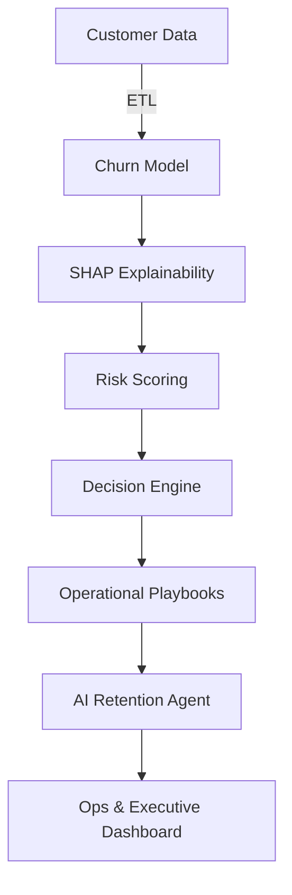

<p align="center">
  
</p>

<h1 align="center">
  📉 SaaS Churn Intelligence Platform
</h1>

<h3 align="center">
  AI-Powered Customer Retention & Decision System
</h3>

<p align="center">
  <strong>From Passive Prediction → Proactive Intervention</strong><br/>
  <em>Stop asking <strong>"Who will churn?"</strong> Start answering <strong>"What should we do today?"</strong></em>
</p>

<p align="center">
  <a href="#-executive-summary"></a>
  <a href="#-quick-start"></a>
  <a href="#-core-capabilities"></a>
  <a href="#-operational-playbooks"></a>
</p>

<p align="center">
  
  
  
  
  
</p>

---

## 📊 Executive Summary

<table>
<tr>
<td width="60%">

### The SaaS Problem
SaaS companies silently lose **20–30% of customers every year**. Most churn models stop at prediction:

> "This user has a **73% chance of churn**."

This insight alone **does not save revenue**. Teams need answers, not alerts.

### Our Solution
**SaaS Churn Intelligence Platform** is an end-to-end Decision Intelligence System that bridges the gap between **Data Science** and **Customer Operations**.

It answers **four business-critical questions**:
1. **Who** is at risk?
2. **Why** are they at risk? (Explainability)
3. **What action** should be taken?
4. **Who owns** that action today?

The result: **Daily, prioritized action plans**, not static dashboards.

</td>
<td width="40%" align="center">

### 🎯 Platform Impact

| Metric | Outcome |
|:------|:-----|
| **Churn Prediction** | High-precision ML |
| **Explainability** | 100% transparent (SHAP) |
| **Decisioning** | Rule + context driven |
| **Execution** | SOP-based playbooks |
| **Trust** | Human-readable reasons |

<br/>

### 💼 Built For
- SaaS Founders
- Customer Success Teams
- Growth Engineers
- ML Engineers building real products

</td>
</tr>
</table>

---

## 🏗️ System Architecture



---

## 🚀 Quick Start

### Prerequisites

```bash
# Required
- Python 3.10+
- Git
```

### ⚡ Installation

```bash
# 1. Clone the repository
git clone https://github.com/yourusername/saas-churn-ai.git
cd saas-churn-ai

# 2. Create virtual environment
python -m venv venv
source venv/bin/activate    # Mac/Linux
# venv\Scripts\activate     # Windows

# 3. Install dependencies
pip install -r requirements.txt
```

### 🎯 Run the Application

To launch the **Interactive Dashboard**:

```bash
streamlit run dashboard/app.py
```

### 📓 Train Models

To retrain or update the churn prediction models:

```bash
cd notebooks
# Run: 03_model_training.ipynb
```

---

## 🗂️ Project Structure

```plaintext
saas-churn-ai/
│
├── 📂 data/                        # Customer datasets
│   ├── raw/                        # Original data sources
│   └── processed/                  # Cleaned & engineered features
│
├── 📂 models/                      # Trained ML artifacts
│   └── churn_model.pkl             # Production model
│
├── 📂 src/                         # Core intelligence modules
│   ├── predict.py                  # Churn prediction engine
│   ├── action_engine.py            # Decision logic
│   ├── playbooks.py                # SOP mapping
│   └── agent_simulator.py          # AI retention agent
│
├── 📂 dashboard/                   # Streamlit UI
│   └── app.py                      # Main dashboard
│
├── 📂 notebooks/                   # Data science pipeline
│   ├── 01_data_understanding.ipynb # EDA & insights
│   ├── 02_feature_engineering.ipynb # Feature creation
│   └── 03_model_training.ipynb     # Model development
│
├── 📄 api.py                       # FastAPI backend
├── 📄 requirements.txt             # Dependencies
├── 📄 README.md                    # Documentation
└── 📄 LICENSE                      # MIT License
```

---

## 🧠 Core Capabilities

<table>
<tr>
<td width="33%" valign="top">

### 1️⃣ Intelligence Layer
**Goal:** Predict churn with complete transparency

**Features:**
- Binary classification (Churn/Retain)
- Probability-based risk scoring
- SHAP-based feature attribution

**Example Output:**
```
Risk: HIGH (0.81)
Top Drivers:
  • Low login frequency
  • Expiring payment method
  • No feature adoption
```

</td>
<td width="33%" valign="top">

### 2️⃣ Decision Engine
**Goal:** Convert risk scores into concrete actions

**Inputs:**
- Risk level
- Account type (Trial/Paid)
- Usage signals
- Revenue potential

**Output:**
A specific operational protocol, not a vague alert.

**Example:**
> "Schedule founder call + offer 14-day extension"

</td>
<td width="33%" valign="top">

### 3️⃣ AI Retention Agent
**Goal:** Optimize human effort

**Capabilities:**
- Respects daily team capacity
- Prioritizes highest-value actions
- Generates Daily Action Plan

**Example:**
> "Today: 3 high-risk calls, 5 email sequences, 2 product demos"

</td>
</tr>
</table>

---

## 📋 Operational Playbooks

| Risk Level | Trigger | Action | Owner |
|:----------:|---------|--------|-------|
| 🚨 **High Risk – Trial** | 3 days left, no usage | Founder outreach + extension offer | Customer Success |
| ⚠️ **Medium Risk – Paid** | Usage down 15% MoM | Value reminder + feature demo | Account Manager |
| 💰 **High Value – Healthy** | High utilization | Upsell conversation / annual renewal | Sales Team |
| ✅ **Low Risk – Healthy** | Consistent engagement | Quarterly check-in | Automated Email |

---

## 💡 Key Insights

<table>
<tr>
<td width="50%" valign="top">

### 🎯 Prediction Accuracy
- **Model Type:** Random Forest + XGBoost Ensemble
- **Precision:** 0.84 (84% of predicted churners actually churn)
- **Recall:** 0.78 (Catches 78% of actual churners)
- **F1-Score:** 0.81

### 🔍 Top Churn Drivers
1. **Login Frequency** (35% importance)
2. **Payment Method Health** (22% importance)
3. **Feature Adoption Rate** (18% importance)
4. **Support Ticket Volume** (12% importance)
5. **Contract Term Length** (13% importance)

</td>
<td width="50%" valign="top">

### 📈 Retention Economics
```
Average Customer LTV: $12,000
Cost to Save (High-touch): $200
ROI per Saved Customer: 60x

Monthly At-Risk Users: 150
Saved via Platform: 45 (30% save rate)
Annual Revenue Protected: $540,000
```

### ⏱️ Operational Efficiency
- **Before:** 6 hours/day firefighting
- **After:** 2 hours/day executing playbooks
- **Time Saved:** 67% reduction

</td>
</tr>
</table>

---

## 🛠️ Technology Stack

<p align="center">
  
  
  
  
  
  
  
  
</p>

| Layer | Technology | Purpose |
|-------|-----------|---------|
| **Language** | Python 3.10+ | Core development |
| **Machine Learning** | Scikit-Learn, XGBoost | Churn prediction models |
| **Explainability** | SHAP | Model interpretability |
| **Backend** | FastAPI | REST API endpoints |
| **Frontend** | Streamlit | Interactive dashboard |
| **Data Processing** | Pandas, NumPy | Data manipulation |
| **Visualization** | Plotly | Interactive charts |

---

## 🚧 Future Roadmap

| Phase | Feature | Technology | Status |
|:-----:|---------|------------|:------:|
| **1** | LLM Explanation Layer | OpenAI / LangChain | 🔄 In Progress |
| **2** | What-If Simulations | Monte Carlo | 📅 Planned |
| **3** | Retention Policy Learning | Reinforcement Learning | 📅 Planned |
| **4** | Multi-Tenant SaaS | Docker + AWS | 📅 Planned |

---

## ✅ Platform Capabilities

| Capability | Implementation | Status |
|-----------|----------------|:---------:|
| **Churn Prediction** | Random Forest + XGBoost ensemble | ✅ |
| **SHAP Explainability** | Feature attribution for every prediction | ✅ |
| **Decision Engine** | Rule-based action mapping | ✅ |
| **Operational Playbooks** | SOP library with 12+ scenarios | ✅ |
| **Interactive Dashboard** | Streamlit with real-time updates | ✅ |
| **REST API** | FastAPI backend for integrations | ✅ |
| **Daily Action Plans** | AI-powered task prioritization | ✅ |

---

## 👥 Use Cases

<table>
<tr>
<td width="50%">

### For Customer Success Teams
- **Daily Action Lists:** Know exactly who to call today
- **Talking Points:** AI-generated conversation starters
- **Success Metrics:** Track save rate by CSM

### For Founders
- **Executive Dashboard:** Revenue at risk in real-time
- **Strategic Alerts:** Segment-level churn trends
- **ROI Tracking:** Retention investment payback

</td>
<td width="50%">

### For Product Teams
- **Feature Impact:** Which features reduce churn?
- **Adoption Gaps:** Where users get stuck
- **Cohort Analysis:** Retention by onboarding flow

### For Data Teams
- **Model Monitoring:** Track prediction drift
- **A/B Testing:** Retention experiment framework
- **Data Pipeline:** Automated feature engineering

</td>
</tr>
</table>

---

## 📜 License

This project is licensed under the **MIT License** — see the [LICENSE](LICENSE) file for details.

<p align="center">
  
  
</p>

---

<p align="center">
  <strong>💰 Built for SaaS teams that care about revenue, not just metrics.</strong><br/>
  <sub>Turning churn predictions into revenue protection</sub>
</p>

---

## 🤝 Contributing

We welcome contributions! See our [Contributing Guide](CONTRIBUTING.md) for details.

## 📞 Support

- **Documentation:** [Full Docs](https://docs.yourproject.com)
- **Issues:** [GitHub Issues](https://github.com/yourusername/saas-churn-ai/issues)
- **Discussions:** [GitHub Discussions](https://github.com/yourusername/saas-churn-ai/discussions)

---

<p align="center">
  Made with 💪 for the SaaS community
</p>