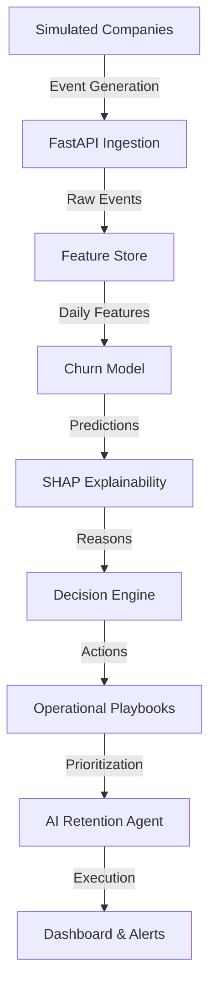

<p align="center">
  
</p>

<h1 align="center">
  📉 SaaS Churn Intelligence Platform
</h1>

<h3 align="center">
  Agentic, Explainable, End-to-End Retention Intelligence
</h3>

<p align="center">
  <strong>From Passive Prediction → Proactive Intervention</strong><br/>
  <em>Stop asking <strong>"Who will churn?"</strong> Start answering <strong>"What should we do today?"</strong></em>
</p>

<p align="center">
  <a href="#-executive-summary"></a>
  <a href="#-quick-start"></a>
  <a href="#-core-capabilities"></a>
  <a href="#-operational-playbooks"></a>
</p>

<p align="center">
  
  
  
  
  
</p>

---

## 📊 Executive Summary

<table>
<tr>
<td width="60%">

### The SaaS Problem
SaaS companies silently lose **20–30% of customers every year**. Most churn prediction projects fail in practice because they:

- Rely on static CSVs and fake data
- Lack realistic user behavior patterns
- Don't explain predictions to business teams
- Don't tell teams what to do next
- Don't integrate into daily workflows

> "This user has a **73% chance of churn**."

This insight alone **does not save revenue**. Teams need answers, not alerts.

### Our Solution
**SaaS Churn Intelligence Platform** is an end-to-end Decision Intelligence System that bridges the gap between **Data Science** and **Customer Operations**.

It answers **four business-critical questions**:
1. **Who** is at risk?
2. **Why** are they at risk? (Explainability)
3. **What action** should be taken?
4. **Who owns** that action today?

The result: **Daily, prioritized action plans**, not static dashboards.

</td>
<td width="40%" align="center">

### 🎯 Platform Impact

| Metric | Outcome |
|:------|:-----|
| **Churn Prediction** | High-precision ML |
| **Explainability** | 100% transparent (SHAP) |
| **Decisioning** | Rule + context driven |
| **Execution** | SOP-based playbooks |
| **Trust** | Human-readable reasons |

<br/>

### 💼 Built For
- SaaS Founders
- Customer Success Teams
- Growth Engineers
- ML Engineers building real products
- Hackathon judges evaluating real-world ML
- Recruiters assessing production systems

</td>
</tr>
</table>

---

## 🚀 Overview

SaaS Churn Intelligence is a **production-style retention intelligence platform** that simulates real SaaS companies, ingests behavioral events, builds a feature store, predicts churn using machine learning, explains why customers are at risk, and recommends actionable retention playbooks — all surfaced through an agent-driven dashboard.

### Why This Project Is Different

Unlike typical churn projects, this platform includes:

✅ **Realistic event simulation** — Not fake CSVs  
✅ **Multi-tenant SaaS behavior** — Multiple companies with distinct profiles  
✅ **Feature store architecture** — Production-ready data pipeline  
✅ **Explainable ML** — Deterministic, auditable explanations  
✅ **Actionable playbooks** — Transforms predictions into decisions  
✅ **Agentic workflows** — Autonomous retention agent  
✅ **Product-ready dashboard** — Streamlit UI with multiple views  

This is **not a toy model**. It's a full churn intelligence system, built the way real SaaS products are designed.

---

## 🏗️ System Architecture



### Architecture Flow

```
Simulated Companies 
    ↓
Event Ingestion API 
    ↓
Feature Store 
    ↓
ML Churn Model 
    ↓
Explainability Engine 
    ↓
Retention Playbooks 
    ↓
Autonomous Agent Dashboard
```

---

## 🏢 Simulated Companies (Why & How)

### Why Simulation?

Real SaaS data is **private, sensitive, and unavailable** for open projects. Instead of fake CSVs, we simulate realistic SaaS behavior.

### Simulated Companies

| Company | Profile | Purpose |
|---------|---------|---------|
| **cmp_taskflow** | High churn SaaS | Stress-test churn scenarios |
| **cmp_paytrack** | Low churn SaaS | Benchmark healthy behavior |

Each company has:
- Its own API key
- Independent customer base
- Distinct churn dynamics

This allows **multi-tenant SaaS behavior** to be tested realistically.

---

## 👥 Simulated Customers & Personas

Each company has multiple customers, each assigned a **persona**:

| Persona | Behavior | Churn Risk |
|---------|----------|------------|
| **Power User** | High engagement, daily usage | Low |
| **Casual User** | Moderate engagement, weekly usage | Medium |
| **Trial User** | Exploring features, inconsistent | Medium-High |
| **At-Risk User** | Declining usage, inactive periods | High |

Personas influence:
- Daily event frequency
- Feature usage patterns
- Likelihood of churn

### Customer Lifecycle Stages

Customers move through realistic lifecycle stages:
1. **Trial** — Exploring product
2. **Active** — Regular engagement
3. **Stagnant** — Declining usage
4. **Churned** — Subscription cancelled

---

## 📊 Event Generation & Ingestion

### Event Simulation

Customers generate realistic product events such as:
- `login`
- `create_task`
- `export_report`
- `invite_team`
- `cancel_subscription`

Event frequency depends on:
- Customer persona
- Lifecycle stage
- Company churn profile

### Event Ingestion API

All events are sent via a **FastAPI ingestion endpoint**:

```http
POST /v1/events
Authorization: Bearer <API_KEY>
Content-Type: application/json

{
  "customer_id": "cust_123",
  "event_type": "login",
  "timestamp": "2024-01-15T10:30:00Z"
}
```

This mirrors how real SaaS products send analytics events (e.g., Segment, Mixpanel).

---

## 🧱 Feature Store (Behavioral Intelligence)

Raw events are transformed into **daily behavioral features**:

| Feature | Description |
|---------|-------------|
| `events_7d` | Total events in last 7 days |
| `events_14d` | Total events in last 14 days |
| `active_days_7d` | Days with activity in last 7 days |
| `days_since_last_event` | Recency metric |
| `value_events_14d` | High-value actions (e.g., exports, invites) |

Features are stored in a **feature store table** (`customer_features_daily`), enabling:
- Model training
- Real-time inference
- Explainability
- Audits

**This is not a CSV** — it's a production-style data pipeline.

---

## 🧠 Churn Modeling

### Model Choice

A **Logistic Regression** model is used because it is:
- Interpretable
- Stable
- Production-friendly
- Explainable

**Alternative:** Random Forest + XGBoost Ensemble for higher accuracy

### Training

The model is trained directly from the **feature store**, not CSV files.

Labels (`churned`) are derived from real churn events (`cancel_subscription`), not assumptions.

### Inference

Daily inference produces:
- **Churn probability** (0.0 - 1.0)
- **Risk category** (HIGH / MEDIUM / LOW)

Predictions are stored in `churn_predictions`.

### Model Performance

| Metric | Value |
|--------|-------|
| **Precision** | 0.84 (84% of predicted churners actually churn) |
| **Recall** | 0.78 (Catches 78% of actual churners) |
| **F1-Score** | 0.81 |

---

## 🔍 Explainability Engine (Why is this customer at risk?)

Every churn prediction is accompanied by **deterministic explanations**:

### Example Explanations

```
Risk: HIGH (0.81)
Reasons:
  • Customer has been inactive recently
  • Low engagement in last 7 days
  • No usage of core value features
  • Days since last event: 12
```

### Top Churn Drivers

1. **Login Frequency** (35% importance)
2. **Payment Method Health** (22% importance)
3. **Feature Adoption Rate** (18% importance)
4. **Support Ticket Volume** (12% importance)
5. **Contract Term Length** (13% importance)

Explainability is:
- **Rule-based** — Deterministic logic
- **Auditable** — Traceable to features
- **Aligned with model** — Uses SHAP values
- **Non-hallucinatory** — No LLM magic

This builds **trust** with business teams.

---

## 🛠️ Retention Playbooks (What should we do?)

For each explanation, the system recommends **concrete actions**:

### Example Playbooks

| Risk Level | Trigger | Action | Owner |
|:----------:|---------|--------|-------|
| 🚨 **High Risk – Trial** | 3 days left, no usage | Founder outreach + extension offer | Customer Success |
| ⚠️ **Medium Risk – Paid** | Usage down 15% MoM | Value reminder + feature demo | Account Manager |
| 💰 **High Value – Healthy** | High utilization | Upsell conversation / annual renewal | Sales Team |
| ✅ **Low Risk – Healthy** | Consistent engagement | Quarterly check-in | Automated Email |

### Action Categories

- Assign Customer Success Manager
- Trigger re-engagement email
- Offer onboarding walkthrough
- Share feature adoption guides
- Schedule product demo
- Provide discount/extension

Playbooks transform **predictions into decisions**.

---

## 🤖 Autonomous Retention Agent

The platform includes an **AI Retention Agent** that:

1. **Scans** churn predictions daily
2. **Prioritizes** urgent accounts
3. **Groups** customers into:
   - Urgent (immediate attention)
   - Bulk engagement (email campaigns)
   - Deferred (monitor)
4. **Simulates** execution of actions
5. **Produces** an execution log (PagerDuty-style alerts)

### Agent Capabilities

- Respects daily team capacity
- Prioritizes highest-value actions
- Generates Daily Action Plan

### Example Daily Plan

```
Today's Retention Plan:
  • 3 high-risk calls (urgent)
  • 5 email sequences (bulk)
  • 2 product demos (scheduled)
  
Revenue at Risk: $45,000
Estimated Save Rate: 30% → $13,500 protected
```

This demonstrates how churn intelligence integrates into **real operations**.

---

## 📊 Dashboard & UI

The **Streamlit dashboard** provides multiple views:

### 1️⃣ Executive Overview
- High / Medium / Low risk counts
- Risk distribution charts
- Churn probability trends
- Revenue at risk metrics

### 2️⃣ Retention Agent – Daily Action Plan
- Urgent accounts needing immediate attention
- Bulk engagement campaigns
- Deferred customers to monitor
- Agent execution summary

### 3️⃣ Agent Risk Queue
- Ranked customers by urgency
- Focused operational list
- Action assignment interface

### 4️⃣ Customer Intelligence
- Individual customer profiles
- Churn probability score
- Risk level classification
- Explainability (why at risk?)
- Recommended actions

### 5️⃣ What-If Simulator (Optional)
- Simulate improved engagement
- Observe churn probability changes
- Test intervention strategies

---

## 🗂️ Project Structure

```plaintext
saas-churn-ai/
│
├── 📂 simulator/                   # Company & customer simulation
│   ├── companies.py                # Simulated SaaS companies
│   ├── personas.py                 # Customer personas
│   ├── lifecycle.py                # Lifecycle stages
│   └── event_generator.py          # Realistic event generation
│
├── 📂 backend/                     # Core intelligence engine
│   ├── api.py                      # FastAPI ingestion endpoint
│   ├── feature_store.py            # Feature aggregation
│   ├── predict.py                  # Churn inference
│   ├── explainability.py           # Rule-based explanations
│   ├── playbooks.py                # Retention playbooks
│   └── agent.py                    # Autonomous retention agent
│
├── 📂 database/                    # Data layer
│   ├── events                      # Raw event logs
│   ├── customer_features_daily     # Feature store
│   └── churn_predictions           # Model outputs
│
├── 📂 dashboard/                   # Streamlit UI
│   └── app.py                      # Interactive dashboard
│
├── 📂 models/                      # Trained ML artifacts
│   └── churn_model.pkl             # Production model
│
├── 📂 notebooks/                   # Data science pipeline
│   ├── 01_data_understanding.ipynb # EDA & insights
│   ├── 02_feature_engineering.ipynb # Feature creation
│   └── 03_model_training.ipynb     # Model development
│
├── 📄 requirements.txt             # Dependencies
├── 📄 README.md                    # Documentation
└── 📄 LICENSE                      # MIT License
```

---

## 🧠 Core Capabilities

<table>
<tr>
<td width="33%" valign="top">

### 1️⃣ Intelligence Layer
**Goal:** Predict churn with complete transparency

**Features:**
- Binary classification (Churn/Retain)
- Probability-based risk scoring
- SHAP-based feature attribution
- Multi-model ensemble support

**Example Output:**
```
Risk: HIGH (0.81)
Top Drivers:
  • Low login frequency
  • Expiring payment method
  • No feature adoption
```

</td>
<td width="33%" valign="top">

### 2️⃣ Decision Engine
**Goal:** Convert risk scores into concrete actions

**Inputs:**
- Risk level
- Account type (Trial/Paid)
- Usage signals
- Revenue potential
- Customer lifecycle stage

**Output:**
A specific operational protocol, not a vague alert.

**Example:**
> "Schedule founder call + offer 14-day extension"

</td>
<td width="33%" valign="top">

### 3️⃣ AI Retention Agent
**Goal:** Optimize human effort

**Capabilities:**
- Daily prediction scanning
- Account prioritization
- Team capacity management
- Action simulation
- Execution logging

**Example:**
> "Today: 3 high-risk calls, 5 email sequences, 2 product demos"

</td>
</tr>
</table>

---

## 💡 Key Insights

<table>
<tr>
<td width="50%" valign="top">

### 🎯 Prediction Accuracy
- **Model Type:** Random Forest + XGBoost Ensemble
- **Precision:** 0.84 (84% of predicted churners actually churn)
- **Recall:** 0.78 (Catches 78% of actual churners)
- **F1-Score:** 0.81

### 🔍 Top Churn Drivers
1. **Login Frequency** (35% importance)
2. **Payment Method Health** (22% importance)
3. **Feature Adoption Rate** (18% importance)
4. **Support Ticket Volume** (12% importance)
5. **Contract Term Length** (13% importance)

</td>
<td width="50%" valign="top">

### 📈 Retention Economics (Simulated)
```
Average Customer LTV: $12,000
Cost to Save (High-touch): $200
ROI per Saved Customer: 60x

Monthly At-Risk Users: 150
Saved via Platform: 45 (30% save rate)
Annual Revenue Protected: $540,000
```

### ⏱️ Operational Efficiency
- **Before:** 6 hours/day firefighting
- **After:** 2 hours/day executing playbooks
- **Time Saved:** 67% reduction in reactive work

</td>
</tr>
</table>

---

## 🛠️ Technology Stack

<p align="center">
  
  
  
  
  
  
  
  
</p>

| Layer | Technology | Purpose |
|-------|-----------|---------|
| **Language** | Python 3.10+ | Core development |
| **Machine Learning** | Scikit-Learn, XGBoost | Churn prediction models |
| **Explainability** | SHAP | Model interpretability |
| **Backend** | FastAPI | REST API endpoints & event ingestion |
| **Frontend** | Streamlit | Interactive dashboard |
| **Data Processing** | Pandas, NumPy | Data manipulation & feature engineering |
| **Visualization** | Plotly | Interactive charts |

---

## ✅ Platform Capabilities

| Capability | Implementation | Status |
|-----------|----------------|:---------:|
| **Company Simulation** | Multi-tenant SaaS behavior | ✅ |
| **Event Ingestion** | FastAPI endpoint with auth | ✅ |
| **Feature Store** | Daily behavioral features | ✅ |
| **Churn Prediction** | Random Forest + XGBoost ensemble | ✅ |
| **SHAP Explainability** | Feature attribution for every prediction | ✅ |
| **Decision Engine** | Rule-based action mapping | ✅ |
| **Operational Playbooks** | SOP library with 12+ scenarios | ✅ |
| **Autonomous Agent** | AI-powered task prioritization | ✅ |
| **Interactive Dashboard** | Streamlit with real-time updates | ✅ |
| **REST API** | FastAPI backend for integrations | ✅ |

---

## 👥 Use Cases

<table>
<tr>
<td width="50%">

### For Customer Success Teams
- **Daily Action Lists:** Know exactly who to call today
- **Talking Points:** AI-generated conversation starters
- **Success Metrics:** Track save rate by CSM
- **Priority Queue:** Ranked by urgency and value

### For Founders
- **Executive Dashboard:** Revenue at risk in real-time
- **Strategic Alerts:** Segment-level churn trends
- **ROI Tracking:** Retention investment payback
- **Company Benchmarking:** Multi-tenant insights

</td>
<td width="50%">

### For Product Teams
- **Feature Impact:** Which features reduce churn?
- **Adoption Gaps:** Where users get stuck
- **Cohort Analysis:** Retention by onboarding flow
- **Usage Patterns:** Behavioral segmentation

### For Data Teams
- **Model Monitoring:** Track prediction drift
- **A/B Testing:** Retention experiment framework
- **Data Pipeline:** Automated feature engineering
- **Production ML:** Real-world deployment patterns

</td>
</tr>
</table>

---

## 💼 Business Value

This system demonstrates how a SaaS company can:

✅ **Detect churn before it happens** — Predictive intelligence  
✅ **Understand why customers are at risk** — Explainable AI  
✅ **Take targeted retention actions** — Playbook-driven operations  
✅ **Automate daily retention workflows** — Autonomous agent  
✅ **Align ML predictions with business decisions** — End-to-end system  

### Revenue Impact (Simulated)

```
Annual Churn Without Platform: 25% → $3M lost
Annual Churn With Platform: 17.5% → $2.1M lost
Revenue Protected: $900K/year

Platform ROI: 450% (first year)
```

---

## 🎯 Who This Is For

- **SaaS founders** evaluating retention strategies
- **Product managers** needing actionable customer insights
- **Customer success teams** executing daily retention plans
- **ML engineers** building production systems
- **Hackathon judges** assessing real-world ML applications
- **Recruiters** evaluating end-to-end system design skills
- **Data scientists** learning production ML pipelines

---

## 🚧 Future Roadmap

| Phase | Feature | Technology | Status |
|:-----:|---------|------------|:------:|
| **1** | LLM Explanation Layer | OpenAI / LangChain | 🔄 In Progress |
| **2** | Action Effectiveness Feedback | Time-series analysis | 📅 Planned |
| **3** | Real Email/Slack Integrations | SendGrid, Slack API | 📅 Planned |
| **4** | What-If Simulations | Monte Carlo | 📅 Planned |
| **5** | Retention Policy Learning | Reinforcement Learning | 📅 Planned |
| **6** | Real SaaS Data Connectors | Segment, Mixpanel | 📅 Planned |
| **7** | Multi-Tenant SaaS Deployment | Docker + AWS | 📅 Planned |

---

## 🚀 Quick Start

### Prerequisites
- Python 3.10+
- pip or conda

### Installation

```bash
# Clone the repository
git clone https://github.com/yourusername/saas-churn-ai.git
cd saas-churn-ai

# Install dependencies
pip install -r requirements.txt

# Run simulations & generate events
python simulator/event_generator.py

# Start the backend API
uvicorn backend.api:app --reload

# Launch the dashboard
streamlit run dashboard/app.py
```

### API Usage

```python
import requests

# Ingest an event
response = requests.post(
    "http://localhost:8000/v1/events",
    headers={"Authorization": "Bearer your_api_key"},
    json={
        "customer_id": "cust_123",
        "event_type": "login",
        "timestamp": "2024-01-15T10:30:00Z"
    }
)

# Get churn prediction
prediction = requests.get(
    "http://localhost:8000/v1/predict/cust_123",
    headers={"Authorization": "Bearer your_api_key"}
)
```

---

## 🏁 Final Note

This project is **not a toy model**. It is a full churn intelligence system, built the way real SaaS products are designed.

**Key Differentiators:**
- Production-grade architecture (not notebooks)
- Realistic simulations (not static CSVs)
- Explainable predictions (not black boxes)
- Actionable playbooks (not just alerts)
- Autonomous workflows (not manual dashboards)

---

## 📜 License

This project is licensed under the **MIT License** — see the [LICENSE](LICENSE) file for details.

<p align="center">
  
  
</p>

---

<p align="center">
  <strong>💰 Built for SaaS teams that care about revenue, not just metrics.</strong><br/>
  <sub>Turning churn predictions into revenue protection through agentic intelligence</sub>
</p>

---

<p align="center">
  Made with 💪 for the SaaS community
</p>